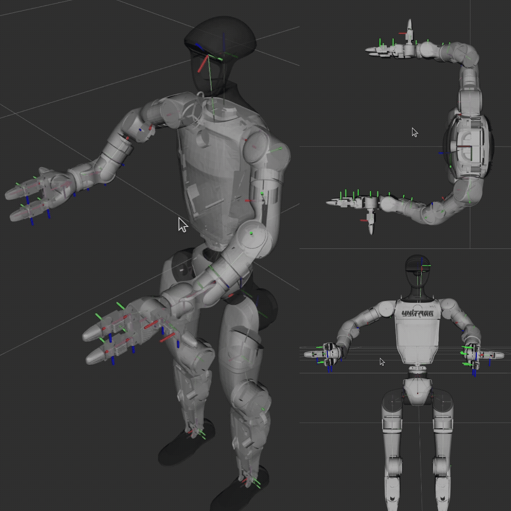

# G1Pilot
  

`g1_pilot` is a ROS2 package and also contains a C++ library for controls, inverse kinematics, collision detection, and motion planning for the upper body of the Unitree G1 HUmanoid robot.

## Key features
1. `arm_pilot` C++ Library
   - Solving for inverse kinematics of the arms of the G1 give SE(3) or 6D pose for the end-effector.
   - Accounting for previous state for closest solution, naturalizing motion
   - Modelled as an optimization problem allowing tuning of weights of different costs (translation, rotation, regularization, and smothening) to achieve desired result.
   - Full inverse dynamics of the robot, assuming fixed legs, to generate joint level commands including gravity feedforward.
   - Optional build using the naive iteration method for inverse kinematics.
   - Self collision detection ensuring desired poses do not result in the arm colliding with itself.
   - Easy to freeze joints to simplify the IK problem as well as allow complex robot usage.
   - Full C++ implementation with simple API. 
2. `ik_joint_state_publisher`  ROS2 executable
   - Publishing joint states as received from the `arm_ik` library to the topic `ik/joint_states`
3. `display.launch.py` ROS2 launch file
   - Visualize the G1 robot in Rviz with TF tree
   - Launched joint_state_publisher, robot_state_publisher and rviz
   - Configures joint_state_publisher to use the `ik/joint_states` topic to publish full `/joint_states` for RViz visualization.

You don't need a robot to use this library.

# Installation

## Building with ROS2
Follow these instructions.
1. (Optional) Create a new workspace
   ```bash
   mkdir g1_ws g1_ws/src
   cd g1_ws/src
   ```
2. Clone the source code
   ```bash
   git clone https://github.com/VectorRobotics/G1Pilot.git
   ```
3. Install dependenceis and set environment variables
   ```bash
   cd G1Pilot
   chmod +x download_dependencies.sh
   source download_dependencies.sh
   ```
4. Build and install
   ```bash
   cd ../..
   colcon build
   ```
5. Source your workspace installations
   ```bash
   source install/setup.bash
   ```

## Building C++ library from source
Follow these instructions.
1. Clone the source code

   ```bash
   git clone https://github.com/VectorRobotics/G1Pilot.git
   ```
2. Install dependencies and set environment variables
   ```bash
   cd G1Pilot
   chmod +x download_dependencies.sh
   sourcce download_dependenceis.sh
   ```
3. Make build and install directories
   ```bash
   mkdir build install && cd build
   ```
4. Configure, make, and install
   ```bash
   cmake ..
   make -j4
   make install
   ```

# How to use

## Use with ROS2
The package provides 3 nodes and 4 launch files.

### Nodes
1. `ik_joint_state_publisher` currently runs a demo of IK moving both the arms sinusoidally in different directions.
2. `joint_traj_publisher` currently runs a demo of motion planning with the right arm commanded to move front and up.
3. `visual_servoing` complete visual servoing given a topic where pose of the target is published. The x axis is expected to be inside the plane at which contact is supposed to be made. (Yet to be tested)

### Launch files
1. `display.launch.py` shows the robot in rviz with robot_state_publisher and joint_state_publisher ready.
2. `demo_ik.launch.py` demos ik
3. `joint_traj_demo.launch.py` demos motion planning

## Use as C++ library

To use IK, do the following in the package
```cpp
#include <g1_pilot/g1_pilot.h>

// Create robot configuration
RobotConfig config;
config.asset_file = "../assets/g1/g1_29dof_with_hand_rev_1_0.urdf";
config.asset_root = "../assets/g1/";
config.NUM_DOF = 29;

// Create handle
G1DualArm arm_handle(&config);

// Define external forces (6D wrenches)
Eigen::VectorXd ext_force_left = Eigen::VectorXd::Zero(6);
Eigen::VectorXd ext_force_right = Eigen::VectorXd::Zero(6);
ext_force_left(2) = 5.0;  // 5N downward force

// Solve IK with collision checking
auto result = arm_handle.ik->solve_ik(
    left_target, right_target,
    nullptr, nullptr,  // current q, dq
    &ext_force_left, &ext_force_right,
    true  // enable collision checking
);

// std::vector<string or double>
result.name
reuslt.position
result.velocity // Not implemented
result.effort
```

### Some helper functions
```cpp
// Helper function to create SE3 transformation matrix
Eigen::Matrix4d create_se3(const Eigen::Quaterniond& q, const Eigen::Vector3d& t) {
    Eigen::Matrix4d transform = Eigen::Matrix4d::Identity();
    transform.block<3, 3>(0, 0) = q.normalized().toRotationMatrix();
    transform.block<3, 1>(0, 3) = t;
    return transform;
}

// Helper function to create SE3 from quaternion components and translation
Eigen::Matrix4d create_se3(double qw, double qx, double qy, double qz, 
                           double tx, double ty, double tz) {
    Eigen::Quaterniond q(qw, qx, qy, qz);
    Eigen::Vector3d t(tx, ty, tz);
    return create_se3(q, t);
}
```

### Publish goal pose
```bash
ros2 topic pub --once /goal_pose geometry_msgs/msg/PoseStamped "{header: {stamp: {sec: 0, nanosec: 0}, frame_id: 'pelvis'}, pose: {position: {x: 0.2, y: -0.2, z: 0.1}, orientation: {w: 1.0}}}"
```